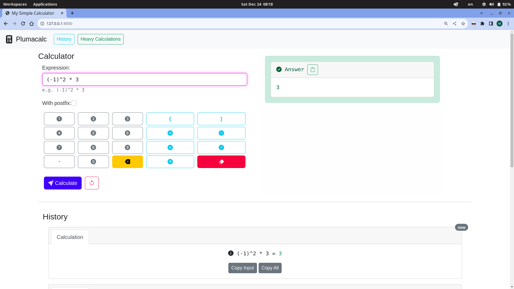

# University Projects

## :material-calculator-variant: **postfixcalc**

`postfixcalc` is a simple yet powerful mathematical expression evaluator
built around postfix notation. It takes ordinary infix expressions,
parses them through Python's AST, transforms them into a postfix
representation, and evaluates the resulting expression while preserving
operator precedence and parentheses.

What makes this project interesting is that it exposes the intermediate
stages of the evaluation process rather than treating the expression as
a black box. It provides access to the parsed AST, extracted and
flattened expressions, parenthesized representations, numerized tokens,
postfix notation, and the final result, while also introducing
calculation and string-representation timeouts for expensive expressions.

:octicons-mark-github-24: [View repository](https://github.com/mahdihaghverdi/postfixcalc)


!!! info

    This project was written as a library for the Data Structures course project named `plumacalc` in University.

??? example "Inspecting the evaluation"
    ```python
    from postfixcalc import Calc

    calc = Calc("(2 ^ 32) ^ (2 ^ 15) + -1")

    print(calc.strparenthesized)
    # (((2 ^ 32)) ^ ((2 ^ 15))) + (-1)

    print(calc.postfix)
    # [2, 32, '^', 2, 15, '^', '^', -1, '+']

    print(calc.stranswer(15, 15))
    # 674114012549907...068940335579135
    ```
---

## :material-web: **plumacalc**

`plumacalc` is a web-based calculator built with Python and Django,
designed around a simple interface while still exposing the mechanics
behind each calculation. It supports common arithmetic operations,
parentheses, powers, rational numbers, and can show the postfix
representation used to evaluate an expression.

The project also explores the engineering side of a calculator service:
calculation history, pagination, copyable results, meaningful error
messages, and protection against expensive calculations through
configurable execution and string-generation timeouts. It combines a
small mathematical evaluator with a complete web application and
persistence layer.



:octicons-mark-github-24: [View repository](https://github.com/mahdihaghverdi/plumacalc)


---

## :material-chip: **cpu**

This project is a simple single-cycle CPU implemented in VHDL as a
computer-architecture project. The goal was to understand the fundamental
relationship between an instruction set, datapath, ALU, control unit,
and the signals that connect them, while making the architectural
decisions explicit in the project's documentation.

The CPU supports a small 32-bit instruction set and is accompanied by
its own assembler, written in Python. The project can be compiled with
GHDL and inspected through GTKWave, making it possible to follow the
design from assembly instructions through machine code and into the
hardware-level execution of the processor.

:octicons-mark-github-24: [View repository](https://github.com/mahdihaghverdi/cpu)
